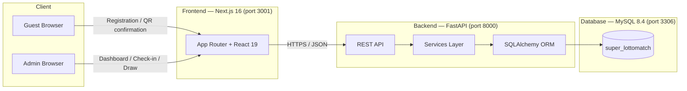

# Architecture

**Date:** 2026-05-12
**Status:** In Development
**Author:** Benji
**Module:** M426 — Software mit agilen Methoden entwickeln (GIBZ Zug)
**Client:** STV Ennetbürgen

This document describes the architecture of **SuperLottomatch**, the web application that digitises the annual Lottomatch raffle for STV Ennetbürgen. It replaces paper slips and Excel spreadsheets with guest self-registration, QR-code check-in, and automated raffle draws. The document targets future developers and graders — it explains *how* the system is put together and *why*. Detailed schemas, ADRs, and deployment scripts live in sibling documents (linked below).

---

## 1. System Overview

SuperLottomatch is a three-tier web application orchestrated by Docker Compose:

- A **Next.js frontend** serves the guest-facing registration flow and the admin dashboard.
- A **FastAPI backend** exposes a REST API, handles business logic, and persists data.
- A **MySQL 8.4 database** stores guests, events, check-ins, prizes, and draws.



The frontend is a single deployment that adapts its UI for desktop (admin) and mobile (guest) clients. The backend is stateless — all state lives in MySQL.

---

## 2. Monorepo Layout

```
super-lottomatch/
├── frontend/              # Next.js 16 app (React 19, TypeScript 5, Tailwind 4)
├── backend/               # FastAPI app (Python 3.12, SQLAlchemy, Pydantic)
├── db/init/               # MySQL 8.4 init scripts (Docker entrypoint)
├── docs/                  # Project documentation (this folder)
├── .github/workflows/     # GitHub Actions CI/CD pipelines
├── docker-compose.yml     # Local dev orchestration
└── .env                   # Local environment variables
```

A single repository keeps the three services in sync and lets a single pull request touch frontend, backend, and schema together when a feature spans layers. See ADR-006 in [`./DECISIONS.md`](./DECISIONS.md).

---

## 3. Frontend Architecture

### Stack

| Concern        | Choice                                       |
|----------------|----------------------------------------------|
| Framework      | Next.js 16 (App Router)                      |
| UI Library     | React 19                                     |
| Language       | TypeScript 5 (strict, no `any`)              |
| Styling        | Tailwind CSS 4 + shadcn/ui                   |
| Build / Lint   | Next build, ESLint 9                         |
| Tests          | Jest + React Testing Library                 |

### Routes

The App Router under `frontend/src/app/` groups routes by audience:

**Guest-facing**

- `/` — Landing page with registration entry point
- `/login` — Returning-guest lookup
- `/datenschutz`, `/impressum` — Legal pages (German)
- `/mobile`, `/desktop` — Device-specific landings

**Admin-facing** (`/dashboard/*`)

- `/dashboard` — KPIs, live check-in stats
- `/dashboard/check-in` — Check-in station
- `/dashboard/guests` and `/dashboard/guests/importieren` — Guest list & import
- `/dashboard/events` — Event and event-day management
- `/dashboard/prizes` — Prize catalog and draws
- `/dashboard/data` — Analytics
- `/dashboard/settings` — Configuration

### Component Structure (Atomic Design)

`frontend/src/components/` follows the atomic design pattern. See [`./ATOMIC-DESIGN.md`](./ATOMIC-DESIGN.md) for full rationale.

| Layer       | Purpose                                  | Examples                                       |
|-------------|------------------------------------------|------------------------------------------------|
| `atoms/`    | Primitive UI building blocks             | `Input`, `Label`, `IconButton`, `StatusPill`   |
| `molecules/`| Small composite components               | `FormField`, `DesktopStatCard`                 |
| `organisms/`| Feature-level UI sections                | `DesktopCheckInPage`, `DesktopLoginForm`       |
| `templates/`| Page layouts that consume organisms      | `DesktopDashboardTemplate`                     |
| `ui/`       | shadcn/ui primitives & shared visuals    | `button.tsx`, `chart.tsx`, `GLSLHills.tsx`     |

### API Client & Data Layer

- `frontend/src/lib/api.ts` — typed fetch helpers (`fetchDashboardData`, `fetchGuests`, `createCheckIn`, etc.) hitting the FastAPI backend at `NEXT_PUBLIC_API_BASE_URL`.
- `frontend/src/lib/supabase.ts` — Supabase client used as a fallback in environments without the FastAPI backend (e.g. preview deploys).
- `frontend/src/lib/utils.ts` — shared helpers (`cn()` for Tailwind class merging).
- `frontend/src/lib/constants.ts` — app-wide constants (locale, brand colours, Mapbox token).

### Internationalisation

The audience is German-speaking (majority aged 40+). Date and number formatting uses `Intl.DateTimeFormat` with the `de-CH` locale; copy is German throughout.

---

## 4. Backend Architecture

### Stack

| Concern        | Choice                              |
|----------------|-------------------------------------|
| Framework      | FastAPI                             |
| Server         | Uvicorn                             |
| ORM            | SQLAlchemy                          |
| Validation     | Pydantic                            |
| Language       | Python 3.12 (PEP 8, line length 88) |
| Format / Lint  | Ruff (`format` + `check`)           |
| Tests          | pytest + pytest-asyncio + httpx + pytest-cov |

### Layered Structure

The backend follows a classic layered design. Each layer has one responsibility, and dependencies flow inward (routers → services → models).

```
backend/
├── main.py            # Compatibility entrypoint for uvicorn main:app
├── database.py        # SQLAlchemy engine + session factory
├── app/
│   ├── factory.py     # FastAPI app creation, CORS, router registration
│   ├── config.py      # Settings / env var loading
│   ├── routers/       # HTTP layer — request parsing, response shaping
│   ├── services/      # Business logic and SQL orchestration
│   ├── models/        # Lightweight domain records used by services/mappers
│   ├── schemas.py     # Pydantic request/response DTOs
│   └── utils.py       # Shared formatting, validation, and QR-code helpers
└── tests/             # pytest suite with service/unit coverage
```

| Layer    | Knows about       | Responsibility                                  |
|----------|-------------------|-------------------------------------------------|
| Router   | Schemas, services | HTTP I/O, status codes, dependency injection    |
| Service  | Models, schemas   | Business rules and SQL-backed workflows         |
| Model    | —                 | Domain records used by mappers/services         |
| Schema   | —                 | Pydantic validation; never imports models       |

### Authentication

`/auth/login` accepts an email and password, looks up the matching admin user, and verifies the hashed password. Successful login returns the admin's id, name, and email. Session handling lives on the frontend. No guest authentication is required — guests are identified by their unique `guest_code`.

---

## 5. Database

The schema is normalised and centred on the `guests`, `lotto_events`, `checkins`, and `draws` tables.

| Table             | Purpose                                                       |
|-------------------|---------------------------------------------------------------|
| `guests`          | One row per person; carries `guest_code` (UUID) and consents  |
| `addresses`       | Normalised postal addresses (referenced by `guests`)          |
| `lotto_events`    | A yearly Lottomatch event                                     |
| `event_days`      | A single day inside an event                                  |
| `checkins`        | Records each guest's attendance per event day (unique pair)   |
| `prizes`          | Prize catalog associated with an event day                    |
| `draws`           | A prize drawn for a specific guest                            |
| `mail_campaigns`  | Marketing campaigns sent post-event                           |

Init scripts under `db/init/` are mounted into the MySQL container's entrypoint, so a fresh container boots with a usable schema. See [`./DATABASE.md`](./DATABASE.md) for ER diagram, indexes, and seed data.

---

## 6. Core Flows

### 6.1 Guest Registration

1. Guest opens the registration page on their phone.
2. Form posts to `POST /guests`; the backend creates an `Address` (or reuses one), then a `Guest` with a freshly generated `guest_code` (UUID).
3. Backend returns the `guest_code`; the frontend renders a QR confirmation page the guest can screenshot or print.

### 6.2 Check-In

1. At the venue, an admin scans the QR (or types the `guest_code` manually).
2. Frontend calls `POST /check-ins/by-code` with the scanned QR/guest code.
3. The check-in service rejects duplicates (unique constraint on `guest_id` + `event_day_id`) and records the method (`qr_code`, `manual_form`, `guest_code`).
4. Successful check-ins update the dashboard's live counters.

### 6.3 Raffle Draw

1. Admin opens `/dashboard/prizes` and selects an undrawn prize.
2. Frontend calls `POST /draws` with the `prize_id`.
3. `raffle_service` queries distinct checked-in guests for the prize's event day, picks one uniformly at random, and persists a `Draw` row.
4. The winning guest is shown on the dashboard.

Each guest can only win once per event day — the service filters out guests that already have a winning draw for that day.

---

## 7. Local Development

```bash
# Start all three services
docker compose up -d

# Frontend:  http://localhost:3001
# Backend:   http://localhost:8000  (Swagger at /docs)
# MySQL:     localhost:3306
```

Required environment variables (committed in `.env` for local dev only):

| Variable                | Purpose                            |
|-------------------------|------------------------------------|
| `MYSQL_ROOT_PASSWORD`   | MySQL root account                 |
| `MYSQL_DATABASE`        | Database name                      |
| `MYSQL_USER`            | App database user                  |
| `MYSQL_PASSWORD`        | App database password              |
| `NEXT_PUBLIC_API_BASE_URL` | Frontend → backend URL          |

Run the services standalone for faster iteration: `uvicorn main:app --reload` from `backend/`, `npm run dev` from `frontend/`.

---

## 8. Deployment & CI/CD

GitHub Actions runs frontend and backend pipelines in parallel on every push and PR: install → lint → test → coverage check (>75%) → build. On `main`, a deploy stage ships the frontend to Vercel and the backend to Railway/Render against a managed MySQL instance. See [`./DEPLOYMENT.md`](./DEPLOYMENT.md) for environment-by-environment details.

---

## 9. Key Architectural Decisions

These are summarised here for orientation; the full reasoning lives in [`./DECISIONS.md`](./DECISIONS.md).

- **ADR-001** Next.js + React + TypeScript — first-class SSR and a familiar component model.
- **ADR-002** FastAPI + Python — fast development, automatic OpenAPI docs.
- **ADR-003** MySQL — sufficient for the scale, well understood by the team.
- **ADR-004** QR codes via `guest_code` UUIDs — privacy-preserving and offline-friendly.
- **ADR-006** Monorepo — simplifies cross-cutting changes for a four-person team.
- **ADR-007** Atomic design — gives a clear vocabulary for component reuse.
- **ADR-008** shadcn/ui — composable primitives we own, not a black-box library.
- **ADR-009** Dashboard-first admin layout.
- **ADR-010** Constants centralisation.

---

## 10. Related Documents

- [`./PRD.md`](./PRD.md) — Product requirements and user goals
- [`./USER-STORIES.md`](./USER-STORIES.md) — Backlog items
- [`./SCOPE.md`](./SCOPE.md) — What's in and out of scope
- [`./API.md`](./API.md) — Endpoint contracts
- [`./DATABASE.md`](./DATABASE.md) — Schema, ER diagram, seed data
- [`./DECISIONS.md`](./DECISIONS.md) — Architecture Decision Records
- [`./DEPLOYMENT.md`](./DEPLOYMENT.md) — CI/CD and hosting
- [`./TESTING.md`](./TESTING.md) — Testing strategy
- [`./UI.md`](./UI.md) — UI guidelines
- [`./ATOMIC-DESIGN.md`](./ATOMIC-DESIGN.md) — Frontend component pattern
- [`./SCRUM.md`](./SCRUM.md) — Process and ceremonies
- [`./LERNZIELE.md`](./LERNZIELE.md) — Learning objectives (M426)
