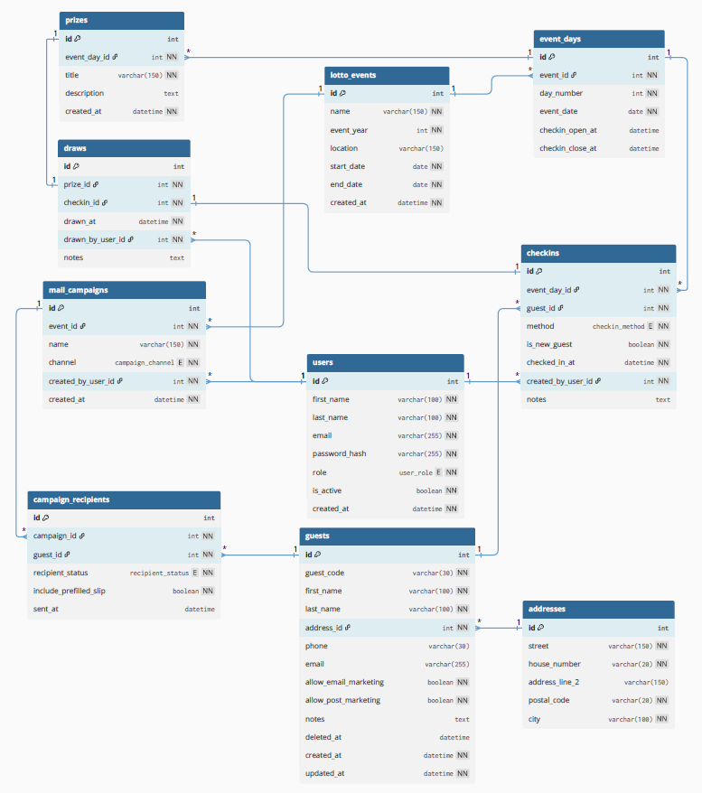

# Database Documentation

This document describes the database structure for the Lottomatch raffle system. It gives developers a quick but reliable overview of how data is stored, how entities relate to each other, and where important business rules are enforced.

## Purpose of the database

The database is the central source of truth for the application. It supports the full raffle workflow:

- storing guest master data and addresses
- managing lottery events and event days
- recording guest check-ins
- assigning prizes and storing draw results
- managing follow-up mail campaigns for future events

In short, the database connects guest registration, QR-code-based identification, attendance tracking, raffle draws, and marketing preparation in one consistent relational model.

## Database technology

**Relational database:** MySQL 8.x  
**Modeling style:** normalized transactional schema with primary keys, foreign keys, unique constraints, and junction tables where needed.

> Note: This documentation assumes MySQL because the project planning and backend setup were previously aligned with MySQL. If the implementation later changes to another relational database, the logical schema still stays the same.

## High-level structure

The schema can be understood in five functional areas:

1. **Identity & administration**  
   `users`, `guests`, `addresses`

2. **Event management**  
   `lotto_events`, `event_days`

3. **Attendance / check-in**  
   `checkins`

4. **Raffle execution**  
   `prizes`, `draws`

5. **Marketing follow-up**  
   `mail_campaigns`, `campaign_recipients`

## QR code-based guest identification

QR-code-based guest identification is modeled through the existing `guest_code` field in `guests`.

- `guest_code` is the **canonical unique guest identifier**.
- The value can be printed as plain text on a prefilled slip or encoded into a QR code.
- The system therefore does **not** need a separate `qr_code` column.
- In `checkins.method`, the enum value `qr_code` documents **how** the guest was checked in, while `guest_code` stores **which identifier** was used.

This keeps the schema simpler and avoids duplicated identification data.

## ERD diagram

### Current ERD



### Source files

- `erd.dbml` – editable schema source
- `erd.mmd` – Mermaid version for markdown-friendly rendering
- `erd.svg` – exported readable diagram

## Entity overview

| Table | Purpose | Key relationships |
|---|---|---|
| `users` | Application users such as admins or staff members | Referenced by `checkins`, `draws`, `mail_campaigns` |
| `addresses` | Normalized guest addresses | Referenced by `guests` |
| `guests` | Master data of raffle guests | Linked to `addresses`, `checkins`, `campaign_recipients` |
| `lotto_events` | Main event container, usually per year | Parent of `event_days` and `mail_campaigns` |
| `event_days` | Individual day of an event | Parent of `checkins` and `prizes` |
| `checkins` | Records attendance of a guest on a given event day | Links `guests`, `event_days`, `users` |
| `prizes` | Prize definitions available on an event day | Referenced by `draws` |
| `draws` | Stores which check-in won which prize | Links `prizes`, `checkins`, `users` |
| `mail_campaigns` | Mailing campaigns for a specific event and channel | Parent of `campaign_recipients` |
| `campaign_recipients` | Recipient list for a campaign | Links `mail_campaigns` and `guests` |

## Key tables and responsibilities

### `users`
Stores internal application accounts.

**Important fields**
- `id` – primary key
- `email` – unique login identifier
- `role` – access role (`admin`, `member`)
- `is_active` – soft enable/disable flag

**Used by**
- `checkins.created_by_user_id`
- `draws.drawn_by_user_id`
- `mail_campaigns.created_by_user_id`

---

### `addresses`
Stores addresses separately to avoid repeated address values across guests and to keep guest master data structured.

**Important fields**
- `id` – primary key
- `street`, `house_number`, `postal_code`, `city` – core address fields

**Constraints**
- unique composite index on `(street, house_number, postal_code, city)`

**Used by**
- `guests.address_id`

---

### `guests`
Central guest master table. Each guest has one unique identifier that can also be represented as a QR code.

**Important fields**
- `id` – primary key
- `guest_code` – unique guest identifier, used for printed slips and QR codes
- `first_name`, `last_name`
- `address_id` – foreign key to `addresses`
- `allow_email_marketing`, `allow_post_marketing` – consent flags
- `deleted_at` – soft delete marker
- `created_at`, `updated_at` – audit timestamps

**Relationships**
- many guests belong to one address record
- one guest can have many check-ins
- one guest can appear in many campaign recipient entries

**Indexes**
- index on `last_name`
- composite index on `(first_name, last_name)`
- unique index on `guest_code`

---

### `lotto_events`
Represents one raffle event, typically for a specific year.

**Important fields**
- `id` – primary key
- `name`
- `event_year`
- `start_date`, `end_date`

**Relationships**
- one event has many `event_days`
- one event has many `mail_campaigns`

---

### `event_days`
Represents a concrete event day inside a multi-day event.

**Important fields**
- `id` – primary key
- `event_id` – foreign key to `lotto_events`
- `day_number` – business numbering such as day 1 or day 2
- `event_date`
- `checkin_open_at`, `checkin_close_at`

**Constraints**
- unique `(event_id, day_number)`
- unique `(event_id, event_date)`

**Relationships**
- one event day has many check-ins
- one event day has many prizes

---

### `checkins`
Stores attendance of a guest on a specific event day. This is effectively the operational link between guests and event days.

**Important fields**
- `id` – primary key
- `event_day_id` – foreign key to `event_days`
- `guest_id` – foreign key to `guests`
- `method` – how the check-in was performed
- `is_new_guest` – indicates whether the guest was newly registered during check-in
- `checked_in_at`
- `created_by_user_id` – user who recorded the check-in

**Constraints**
- unique `(event_day_id, guest_id)` ensures one guest can only check in once per event day

**Relationships**
- many check-ins belong to one guest
- many check-ins belong to one event day
- many check-ins can be created by one user
- one check-in can be used in at most one draw

**Check-in methods**
- `guest_code` – manual entry of the printed identifier
- `qr_code` – scan of the same identifier in QR format
- `manual_form`, `self_registration`, `member_registration` – alternative flows

---

### `prizes`
Stores the prizes available on a specific event day.

**Important fields**
- `id` – primary key
- `event_day_id` – foreign key to `event_days`
- `title`
- `description`

**Relationships**
- many prizes belong to one event day
- one prize can be assigned in exactly zero or one draw

---

### `draws`
Stores the actual raffle result by linking one prize to one winning check-in.

**Important fields**
- `id` – primary key
- `prize_id` – unique foreign key to `prizes`
- `checkin_id` – unique foreign key to `checkins`
- `drawn_at`
- `drawn_by_user_id` – user who executed or confirmed the draw

**Constraints**
- unique `prize_id` means one prize can only be drawn once
- unique `checkin_id` means one check-in can only win once within this structure

**Relationships**
- one draw belongs to exactly one prize
- one draw belongs to exactly one winning check-in
- many draws can be performed by one user

---

### `mail_campaigns`
Represents a mailing campaign for a specific event and channel.

**Important fields**
- `id` – primary key
- `event_id` – foreign key to `lotto_events`
- `name`
- `channel` – `post` or `email`
- `created_by_user_id`
- `created_at`

**Constraints**
- unique `(event_id, channel)` allows only one campaign per channel per event in the current model

**Relationships**
- many campaigns belong to one event
- many campaigns can be created by one user
- one campaign has many recipient records

---

### `campaign_recipients`
Junction table between `mail_campaigns` and `guests`, extended with delivery-specific fields.

**Important fields**
- `id` – primary key
- `campaign_id` – foreign key to `mail_campaigns`
- `guest_id` – foreign key to `guests`
- `recipient_status` – workflow state for delivery
- `include_prefilled_slip` – whether a prefilled slip should be included
- `sent_at`

**Constraints**
- unique `(campaign_id, guest_id)` prevents duplicate recipient entries within the same campaign

**Relationships**
- many recipient rows belong to one campaign
- many recipient rows belong to one guest

## Relationship summary

### Core cardinalities

- `addresses` **1:n** `guests`
- `lotto_events` **1:n** `event_days`
- `event_days` **1:n** `checkins`
- `guests` **1:n** `checkins`
- `users` **1:n** `checkins`
- `event_days` **1:n** `prizes`
- `prizes` **1:1** `draws`
- `checkins` **1:1** `draws`
- `users` **1:n** `draws`
- `lotto_events` **1:n** `mail_campaigns`
- `mail_campaigns` **1:n** `campaign_recipients`
- `guests` **1:n** `campaign_recipients`

### Derived many-to-many relationships

Some business relationships are implemented through link tables with extra attributes:

- `guests` **n:m** `event_days` through `checkins`
- `guests` **n:m** `mail_campaigns` through `campaign_recipients`

## Constraints and design notes

### Foreign keys

The current ERD defines the following foreign key structure:

- `guests.address_id -> addresses.id`
- `event_days.event_id -> lotto_events.id`
- `checkins.event_day_id -> event_days.id`
- `checkins.guest_id -> guests.id`
- `checkins.created_by_user_id -> users.id`
- `prizes.event_day_id -> event_days.id`
- `draws.prize_id -> prizes.id`
- `draws.checkin_id -> checkins.id`
- `draws.drawn_by_user_id -> users.id`
- `mail_campaigns.event_id -> lotto_events.id`
- `mail_campaigns.created_by_user_id -> users.id`
- `campaign_recipients.campaign_id -> mail_campaigns.id`
- `campaign_recipients.guest_id -> guests.id`

### Cascading rules

No explicit `ON DELETE` / `ON UPDATE` cascading behavior is defined in the current ERD.

For now, this should be documented as:

- **Current state:** no explicit cascading rules modeled
- **Recommended default:** `RESTRICT` / `NO ACTION` for critical operational data until business rules are finalized

That is safer for raffle history, draw history, and campaign tracking.

### Unique constraints and indexes

Important uniqueness and indexing decisions:

- `users.email` is unique
- `guests.guest_code` is unique
- `addresses(street, house_number, postal_code, city)` is unique
- `event_days(event_id, day_number)` is unique
- `event_days(event_id, event_date)` is unique
- `checkins(event_day_id, guest_id)` is unique
- `draws.prize_id` is unique
- `draws.checkin_id` is unique
- `mail_campaigns(event_id, channel)` is unique
- `campaign_recipients(campaign_id, guest_id)` is unique
- search-oriented indexes exist for `guests.last_name` and `(first_name, last_name)`

These constraints are important because they protect business rules directly at database level instead of relying only on backend code.

## Suggested placement in the repository

```text
docs/
└── database/
    ├── README.md
    ├── erd.dbml
    ├── erd.mmd
    └── erd.svg
```

This keeps the database documentation in one predictable location and makes it easy for new developers to find both the explanation and the diagram source.

## Maintenance notes

To keep the documentation maintainable:

- update `erd.dbml` first when the schema changes
- regenerate or update the ERD export afterwards
- keep `README.md` focused on structure and business meaning, not SQL implementation detail
- document only important constraints and workflows that affect development decisions

## Conclusion

The current schema is well suited for the project because it separates guest master data, event operations, raffle logic, and campaign follow-up into clear domains. The QR-code requirement is already covered cleanly through `guest_code` plus the `checkins.method` enum, so no structural duplication is needed.
