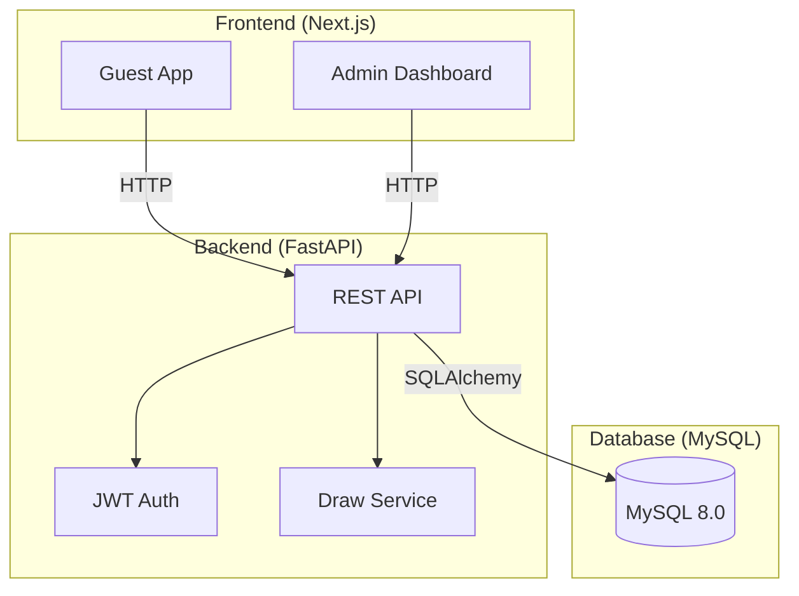
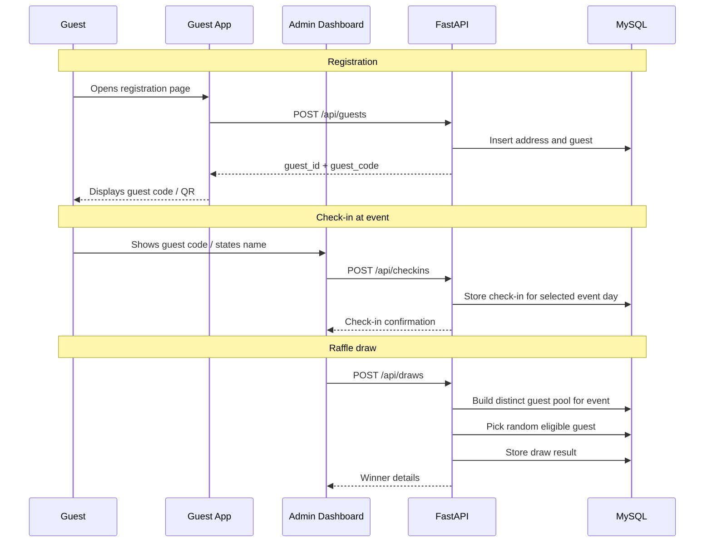

# Project Trace — SuperLottomatch
## System Specification v1.1

**Date:** 2026-04-08  
**Status:** Archived planning snapshot
**Team Size:** 4  
**Timeline:** 5 weeks (GIBZ M426)

> This document preserves the original project target state and course planning.
> It does **not** describe the repository's exact current implementation anymore.
>
> Current source-of-truth docs:
> - `README.md`
> - `docs/ARCHITECTURE.md`
> - `docs/API.md`
> - `docs/DATABASE.md`
> - `docs/TESTING.md`

## Current implementation snapshot

As of 2026-04-25, the repository currently contains:

- a Next.js frontend with public routes (`/`, `/login`, `/mobile`, legal pages)
- a dashboard shell plus implemented mock-data pages for events, guests, guest import, check-in, prizes, data, and settings
- a FastAPI backend with `GET /` and `POST /auth/login`
- a MySQL bootstrap SQL file that currently seeds only a `users` table

Treat the remaining sections below as the intended/target product specification, not the live repo contract.

---

## Table of Contents
1. [Executive Summary](#1-executive-summary)
2. [Problem Statement](#2-problem-statement)
3. [Solution Architecture](#3-solution-architecture)
4. [Guest App Specification](#4-guest-app-specification)
5. [Admin Dashboard Specification](#5-admin-dashboard-specification)
6. [Backend Specification](#6-backend-specification)
7. [Database Schema](#7-database-schema)
8. [AI Pipeline](#8-ai-pipeline)
9. [Data Model](#9-data-model)
10. [API Contracts](#10-api-contracts)
11. [Infrastructure](#11-infrastructure)
12. [Testing Strategy](#12-testing-strategy)
13. [Demo Data](#13-demo-data)

---

## 1. Executive Summary

SuperLottomatch is a web application that digitalizes the annual Lottomatch raffle event organized by STV Ennetbürgen. It replaces the current manual workflow of paper slips and Excel spreadsheets with a web-based guest registration system, fast guest lookup and check-in, and a digital raffle draw workflow.

The system consists of:

- a **guest-facing web app** for registration and guest-code display
- an **admin dashboard** for check-ins, guest management, and raffle draws
- a **FastAPI backend**
- a **MySQL database**

Key facts:

- **80%+ returning guests** year over year
- **Two-day event** with guests potentially attending both days
- **Target demographic:** majority aged 40+
- **Main marketing channel:** postal mail
- **OS-independent:** browser-based solution
- **Team:** 4 members working in Scrum over 5 weeks

The database design supports:

- guest and address management
- attendance on multiple event days
- one raffle chance **per check-in**
- QR-code-based quest identification through *guest_code*
- future-ready postal campaign tracking

Note: A guest who checks in on both event days receives two chances in total, because each check-in is treated as a separate raffle entry. A guest who checks in on only one day receives one chance.
---

## 2. Problem Statement

### Current State

The STV Ennetbürgen currently manages the Lottomatch raffle through a semi-digital process:

- Guest addresses are stored in an Excel spreadsheet, each with a unique ID
- Returning guests receive pre-printed paper slips with their address and ID via postal mail
- New guests fill out blank paper slips at the event
- During the event, club members manually match collected slips against the Excel spreadsheet
- Guests not seen in 3+ years are removed from the list

### Pain Points

| Problem | Impact |
|---------|--------|
| Manual Excel matching during the event | Slow and error-prone, creates bottlenecks |
| Handwritten slips from new guests | Hard to read, leads to data entry errors |
| No real-time attendance tracking | Club members cannot see who has checked in |
| 3-year cleanup rule is manual | Easy to forget, leads to stale data |
| Paper slips can be lost | Guests may not be entered correctly |
| Two-day event handling is awkward | Same guest may attend both days, which must be tracked clearly and fairly for the raffle |

### Opportunity

The process can be digitalized from guest registration to the actual draw. This reduces manual work, improves data quality, supports the two-day event structure, and makes the system easier to use for non-technical club members.

---

## 3. Solution Architecture

### High-Level Overview



### Main User Flow



### Key Design Decisions

- The application is **browser-based** and therefore OS-independent
- The Lottomatch is modeled as **one event with multiple event days**
- Check-ins are stored **per event day**
- The raffle draw is based on **distinct guests per event**, so a guest attending both days only counts once in the raffle pool
- Postal mail remains the main marketing channel, while email support stays optional for the future

- The application is **browser-based** and therefore OS-independent
- The Lottomatch is modeled as **one event with multiple event days**
- Check-ins are stored **per event day**
- The raffle draw is based on check-ins, **not on distinct guests**
- A guest attending both days receives **two chances**, because they produce two check-ins
- A guest attending only one day receives **one chance**
- The winning draw entry is stored via `draws.checkin_id`
- Postal mail remains the main marketing channel, while email support stays optional for the future
---

## 4. Guest App Specification

The guest-facing app is a public web application optimized for mobile devices and simple usage.

### Pages

| Route | Page | Description |
|-------|------|-------------|
| `/` | Landing Page | Simple start page with two main actions: new guest registration and returning guest lookup |
| `/register` | Registration | Form for first name, last name, street, house number, postal code, city, optional phone/email |
| `/confirmed` | Confirmation | Shows registration success and the personal guest code / QR code |
| `/lookup` | Returning Guest Lookup | Optional helper page to look up guest data by guest code or name |

### Design Constraints

- **Minimum font size:** 18px for body text
- **Touch targets:** minimum 48px height
- **Language:** German
- **Very low complexity:** few steps, large buttons, clear labels
- **No guest login required**
- **Responsive:** mobile-first, but also usable on a laptop

### Core Guest Use Cases

1. New guest enters address data
2. System creates guest record and guest code
3. Guest saves or screenshots the code / QR
4. Returning guest can be found quickly using code or name
5. At the event, the club member performs the actual check-in in the admin dashboard

---

## 5. Admin Dashboard Specification

The admin dashboard is the internal part of the application used by club members.

### Pages

| Route | Page | Description |
|-------|------|-------------|
| `/admin/login` | Login | Member login for authorized users |
| `/admin/guests` | Guest List | Searchable list of guests with address data, guest code, and last attendance |
| `/admin/checkins` | Check-in Station | Fast lookup by guest code or name, then check-in for a selected event day |
| `/admin/draws` | Raffle Draw | Select prize and draw a random eligible guest from the event |
| `/admin/events` | Event Management | Manage the Lottomatch event and its event days |
| `/admin/cleanup` | Cleanup View | Shows guests with no participation in 3+ years |
| `/admin/export` | CSV Export | Export guest data for postal mail merge |

### Authentication

- Authorized club members log in with stored member accounts
- Roles support at least **admin** and **member**
- JWT token is issued on login
- Session remains valid for the active event day
- The UI should still stay very simple because the customer has little IT knowledge

### Admin Use Cases

- Search guest by name or guest code
- Register a new guest quickly at the event
- Check in a guest for a specific day
- See who already checked in
- Run raffle draws based on the selected prize and its event day
- Export guest data for postal mail
- Identify inactive guests for cleanup

### Optional Future Scope

The schema supports postal campaign tracking, but the minimum viable product can already succeed with guest export only. Detailed campaign management can be added later if the team wants.

---

## 6. Backend Specification

### Technology

- **Runtime:** Python 3.12+
- **Framework:** FastAPI
- **ORM:** SQLAlchemy 2.0
- **Validation:** Pydantic v2
- **Server:** Uvicorn
- **Auth:** JWT
- **Database:** MySQL 8.0

### Project Structure

```text
backend/
├── app/
│   ├── main.py
│   ├── database.py
│   ├── config.py
│   ├── routers/
│   │   ├── auth.py
│   │   ├── guests.py
│   │   ├── checkins.py
│   │   ├── draws.py
│   │   ├── events.py
│   │   ├── prizes.py
│   │   └── campaigns.py
│   ├── models/
│   │   ├── user.py
│   │   ├── address.py
│   │   ├── guest.py
│   │   ├── lotto_event.py
│   │   ├── event_day.py
│   │   ├── checkin.py
│   │   ├── prize.py
│   │   ├── draw.py
│   │   ├── mail_campaign.py
│   │   └── campaign_recipient.py
│   ├── schemas/
│   │   ├── auth.py
│   │   ├── guest.py
│   │   ├── checkin.py
│   │   ├── draw.py
│   │   ├── event.py
│   │   ├── prize.py
│   │   └── campaign.py
│   └── services/
│       ├── raffle_service.py
│       ├── guest_service.py
│       └── export_service.py
├── tests/
├── requirements.txt
└── Dockerfile
```

### Backend Responsibilities

- Validate input data
- Create and update guest/address records
- Handle check-ins for specific event days
- Build the raffle pool from **eligible check-ins**
- Ensure a prize is only drawn from check-ins belonging to the same event day as the prize
- Execute the draw and persist the result
- Authenticate admin users
- Export guest data for postal mailing
- Optionally manage campaign tracking

### Raffle Service Rules

The raffle service must enforce the following logic:
- each stored check-in counts as one raffle chance
- one guest may have multiple chances if they checked in on multiple days
- one guest may only check in once per event day
- one `checkin_id` may only be used in one draw
- one `prize_id` may only appear in one draw
- when drawing a winner, only check-ins from the same event day as the prize are eligible

---

## 7. Database Schema

### Entity-Relationship Diagram

The current ERD is documented in:


### DBML Source

```dbml
// enum = unchangeable values

Enum user_role {
  admin
  member
}

Enum checkin_method {
  guest_code
  manual_form
  self_registration
  member_registration
  qr_code
}

Enum campaign_channel {
  post
  email
}

Enum recipient_status {
  planned
  printed
  sent
  returned
}

Table users {
  id int [pk, increment]
  first_name varchar(100) [not null]
  last_name varchar(100) [not null]
  email varchar(255) [not null, unique]
  password_hash varchar(255) [not null]
  role user_role [not null, default: 'member']
  is_active boolean [not null, default: true]
  created_at datetime [not null]
}

Table addresses {
  id int [pk, increment]
  street varchar(150) [not null]
  house_number varchar(20) [not null]
  address_line_2 varchar(150)
  postal_code varchar(20) [not null]
  city varchar(100) [not null]

  Indexes {
    (street, house_number, postal_code, city) [unique]
  }
}

Table guests {
  id int [pk, increment]
  guest_code varchar(30) [not null, unique, note: 'Eindeutige ID auf vorgedrucktem Zettel / QR-Code']
  first_name varchar(100) [not null]
  last_name varchar(100) [not null]
  address_id int [not null]
  phone varchar(30)
  email varchar(255)
  allow_email_marketing boolean [not null, default: false]
  allow_post_marketing boolean [not null, default: true]
  notes text
  deleted_at datetime
  created_at datetime [not null]
  updated_at datetime [not null]

  Indexes {
    last_name
    (first_name, last_name)
  }
}

Table lotto_events {
  id int [pk, increment]
  name varchar(150) [not null]
  event_year int [not null]
  location varchar(150)
  start_date date [not null]
  end_date date [not null]
  created_at datetime [not null]
}

Table event_days {
  id int [pk, increment]
  event_id int [not null]
  day_number int [not null, note: 'E.g 1 or 2']
  event_date date [not null]
  checkin_open_at datetime
  checkin_close_at datetime

  Indexes {
    (event_id, day_number) [unique]
    (event_id, event_date) [unique]
  }
}

Table checkins {
  id int [pk, increment]
  event_day_id int [not null]
  guest_id int [not null]
  method checkin_method [not null]
  is_new_guest boolean [not null, default: false]
  checked_in_at datetime [not null]
  created_by_user_id int [not null]
  notes text

  Indexes {
    (event_day_id, guest_id) [unique]
  }
}

Table prizes {
  id int [pk, increment]
  event_day_id int [not null]
  title varchar(150) [not null]
  description text
  created_at datetime [not null]
}

Table draws {
  id int [pk, increment]
  event_id int [not null]
  prize_id int [not null, unique]
  guest_id int [not null]
  drawn_at datetime [not null]
  drawn_by_user_id int [not null]
  notes text

  Indexes {
    (event_id, guest_id)
  }
}

Table mail_campaigns {
  id int [pk, increment]
  event_id int [not null]
  name varchar(150) [not null]
  channel campaign_channel [not null, default: 'post']
  created_by_user_id int [not null]
  created_at datetime [not null]

  Indexes {
    (event_id, channel) [unique]
  }
}

Table campaign_recipients {
  id int [pk, increment]
  campaign_id int [not null]
  guest_id int [not null]
  recipient_status recipient_status [not null, default: 'planned']
  include_prefilled_slip boolean [not null, default: true]
  sent_at datetime

  Indexes {
    (campaign_id, guest_id) [unique]
  }
}

Ref: "guests"."address_id" > "addresses"."id"

Ref: "lotto_events"."id" < "event_days"."event_id"

Ref: "event_days"."id" < "checkins"."event_day_id"
Ref: "guests"."id" < "checkins"."guest_id"
Ref: "users"."id" < "checkins"."created_by_user_id"

Ref: "event_days"."id" < "prizes"."event_day_id"

Ref: "lotto_events"."id" < "draws"."event_id"
Ref: "prizes"."id" - "draws"."prize_id"
Ref: "guests"."id" < "draws"."guest_id"
Ref: "users"."id" < "draws"."drawn_by_user_id"

Ref: "lotto_events"."id" < "mail_campaigns"."event_id"
Ref: "users"."id" < "mail_campaigns"."created_by_user_id"

Ref: "guests"."id" < "campaign_recipients"."guest_id"
Ref: "mail_campaigns"."id" < "campaign_recipients"."campaign_id"
```

### Schema Notes

- **users** stores admin/member accounts
- **addresses** stores normalized address data
- **guests** stores guest identity and references one address
- **guest_code** is the unique identity and references one address
- **lotto_events** stores the yearly Lottomatch event
- **event_days** stores the individual days of a Lottomatch
- **checkins** stores attendance per guest and per event day
- **prizes** stores prizes assigned to a specific event day
- **draws** stores the raffle result by linking prize to a winning check-in
- **mail_campaigns** and **campaign_recipients** support postal mailing processes and future extensions

---

## 8. AI Pipeline

Not applicable for this project.

---

## 9. Data Model

See [Section 7: Database Schema](#7-database-schema) for the full ERD and DBML source.

### Key Relationships

- A **guest** has one **address**
- A **Lottomatch event** has multiple **event days**
- A **guest** can check in on multiple **event days**
- A guest can only check in **once per event day**
- A **prize** belongs to one **event day**
- A **draw** links one **prize** to one winning **check-in**
- A winning **check-in** indirectly identifies the winning guest
- One **check-in** equals **one raffle chance**
- A guest attending both days has two separate raffle chances
- A **mail campaign** belongs to one **event**
- A **campaign recipient** links a **guest** to a **campaign**

### Raffle Logic

The application does **not** use a separate raffle entry table. Instead:

1. Guests check in on one or more event days
2. Every stored **check-in** acts as one raffle entry
3. When a prize is drawn, the backend determines the prize's `event_day_id`
4. The backend loads all eligible check-ins for that event day
5. Check-ins already used in `draws` are excluded
6. A random eligible check-in is selected
7. The results is stored in `draws` with `prize-id` and `check_id`

## Important Constraint

Because `draws` stores `checkin_id` and not `guest_id`, the current design prevents the **same check-in** from winning twice, but it does not automatically prevent the same guest from winning twice across diferent days.

---

## 10. API Contracts

All endpoints are prefixed with `/api`. Request and response bodies are JSON.

### Auth

| Method | Endpoint | Description | Auth |
|--------|----------|-------------|------|
| POST | `/api/auth/login` | Member/admin login | No |
| GET | `/api/auth/me` | Current authenticated user | Yes |

**POST /api/auth/login** — Request:
```json
{
  "email": "mitglied@superlottomatch.local",
  "password": "***"
}
```

**POST /api/auth/login** — Response:
```json
{
  "token": "eyJhbGciOiJIUzI1NiIs...",
  "expires_in": 86400,
  "role": "member"
}
```

### Guests

| Method | Endpoint | Description | Auth |
|--------|----------|-------------|------|
| POST | `/api/guests` | Register a new guest | No |
| GET | `/api/guests` | List guests | Yes |
| GET | `/api/guests/{id}` | Get guest by ID | Yes |
| GET | `/api/guests/code/{guest_code}` | Look up guest by guest code | Yes |
| PUT | `/api/guests/{id}` | Update guest | Yes |
| DELETE | `/api/guests/{id}` | Soft-delete guest | Yes |
| GET | `/api/guests/export` | Export guest list as CSV | Yes |

**POST /api/guests** — Request:
```json
{
  "first_name": "Samuel",
  "last_name": "Stinker",
  "street": "Dorfstrasse",
  "house_number": "67",
  "postal_code": "6373",
  "city": "Ennetbürgen",
  "phone": "0791234567",
  "email": "samuel.stinker@example.ch"
}
```

**POST /api/guests** — Response:
```json
{
  "id": 1,
  "guest_code": "GL-2026-000001",
  "first_name": "Samuel",
  "last_name": "Stinker",
  "address": {
    "street": "Dorfstrasse",
    "house_number": "67",
    "postal_code": "6373",
    "city": "Ennetbürgen"
  },
  "created_at": "2026-03-31T10:00:00"
}
```

### Lotto Events

| Method | Endpoint | Description | Auth |
|--------|----------|-------------|------|
| POST | `/api/events` | Create a Lottomatch event | Yes |
| GET | `/api/events` | List events | Yes |
| GET | `/api/events/{id}` | Get event details | Yes |
| GET | `/api/events/{id}/days` | List event days | Yes |
| POST | `/api/events/{id}/days` | Add an event day | Yes |

### Check-ins

| Method | Endpoint | Description | Auth |
|--------|----------|-------------|------|
| POST | `/api/checkins` | Check in a guest for an event day | Yes |
| GET | `/api/checkins?event_day_id={id}` | List check-ins for an event day | Yes |
| GET | `/api/guests/{id}/checkins` | Check-in history for a guest | Yes |

**POST /api/checkins** — Request:
```json
{
  "guest_id": 1,
  "event_day_id": 1,
  "method": "qr_code"
}
```

**POST /api/checkins** — Response:
```json
{
  "id": 1,
  "guest_id": 1,
  "event_day_id": 1,
  "method": "qr_code",
  "checked_in_at": "2026-04-05T18:42:00"
}
```

### Prizes

| Method | Endpoint | Description | Auth |
|--------|----------|-------------|------|
| GET | `/api/prizes?event_day_id={id}` | List prizes for an event day | Yes |
| POST | `/api/prizes` | Create prize | Yes |

### Draws

| Method | Endpoint | Description | Auth |
|--------|----------|-------------|------|
| POST | `/api/draws` | Draw a winner for a prize | Yes |
| GET | `/api/draws?event_id={id}` | List draw history for an event | Yes |

**POST /api/draws** — Request:
```json
{
  "prize_id": 1
}
```

**POST /api/draws** — Response:
```json
{
  "id": 1,
  "prize_id": 1,
  "checkin_id": 7,
  "winner": {
    "id": 3,
    "first_name": "Bob",
    "last_name": "Bob",
    "city": "Bobcity"
  },
  "drawn_at": "2026-04-05T20:30:00"
}
```

### Campaigns (Optional / Future-Ready)

| Method | Endpoint | Description | Auth |
|--------|----------|-------------|------|
| GET | `/api/campaigns` | List campaigns | Yes |
| POST | `/api/campaigns` | Create campaign | Yes |
| GET | `/api/campaigns/{id}/recipients` | List campaign recipients | Yes |

---

## 11. Infrastructure

### Repository

- **GitHub:** `rabbitglauser/super-lottomatch`
- **Structure:** Monorepo with `/frontend` and `/backend`

### CI/CD Pipeline

- **Platform:** GitHub Actions
- **Trigger:** Every push and pull request on all branches
- **Stages:**
  1. Install dependencies
  2. Run linting
  3. Run tests
  4. Check coverage threshold
  5. Build frontend and backend
  6. Deploy on `main`

### Deployment

| Component | Platform | Notes |
|-----------|----------|-------|
| Frontend | Vercel | Easy deployment for Next.js |
| Backend | Railway or Render | Suitable for FastAPI |
| Database | Railway MySQL | Simple managed MySQL option |

### Local Development

- Docker Compose for frontend, backend, and database
- Hot reload for frontend and backend
- Seed script for demo data

---

## 12. Testing Strategy

### Coverage Target

- **Minimum:** 75% line coverage
- **CI enforcement:** pipeline fails if tests fail or coverage drops too low

### Backend Testing

| Area | What to test |
|------|-------------|
| Auth | Login, token creation, token validation |
| Guest CRUD | Create, update, fetch, soft-delete |
| Address handling | Correct creation and relation to guests |
| Check-ins | Valid check-in, duplicate prevention per event day |
| Events | Create event and event days |
| Draws | Eligible check-in selection for the prize's event day |
| Draws | Exclusion of already-used check-ins
| Draws | Correct handling of guests with one vs. two check-ins
| Prizes | Prize creation and lookup |
| Export | Guest export format for postal mailing |

### Frontend Testing

| Area | What to test |
|------|-------------|
| Registration form | Field validation and submission |
| Guest confirmation | Guest code / QR display |
| Check-in flow | Lookup, confirmation, duplicate handling |
| Admin lists | Guest search, filter, rendering |
| Draw UI | Prize selection, winner display |
| Auth screens | Login handling and protected routes |

### Integration Testing

- End-to-end API tests with FastAPI test client
- Test database for isolated runs
- Draw logic tests to verify:
    - one check-in equals one chance
    - two check-ins for the same guest equal two chances
    - one check-in cannot win twice
    - prize and winning check-in belong to the same event day

---

## 13. Demo Data

A seed script (`backend/seed.py`) populates the database with realistic test data.

### Lotto Event

| Field | Value |
|------|-------|
| Name | Lottomatch 2026 |
| Event Year | 2026 |
| Location | Ennetbürgen |
| Start Date | 2026-04-05 |
| End Date | 2026-04-06 |

### Event Days

| Day Number | Date |
|-----------|------|
| 1 | 2026-04-05 |
| 2 | 2026-04-06 |

### Sample Guests (20)

Swiss-German addresses from the Ennetbürgen region:

| # | Name | Address |
|---|------|---------|
| 1 | Samuel Stinker | Dorfstrasse 12, 6373 Ennetbürgen |
| 2 | Bob Bob | Seeweg 4, 6373 Ennetbürgen |
| 3 | Peter Amstad | Buochserstrasse 8, 6373 Ennetbürgen |
| 4 | Anna Barmettler | Stanserstrasse 22, 6373 Ennetbürgen |
| 5 | Josef Niederberger | Hauptstrasse 15, 6374 Buochs |
| 6 | Ruth Christen | Bahnhofstrasse 3, 6374 Buochs |
| 7 | Werner Lussi | Kirchweg 7, 6370 Stans |
| 8 | Elisabeth Odermatt | Schmiedgasse 11, 6370 Stans |
| 9 | Karl Bürgi | Seestrasse 19, 6375 Beckenried |
| 10 | Margrit Wyrsch | Rütenenstrasse 5, 6375 Beckenried |
| 11 | Franz Achermann | Hergiswilstrasse 14, 6052 Hergiswil |
| 12 | Heidi Zimmermann | Kirchplatz 2, 6052 Hergiswil |
| 13 | Bruno Kiser | Pilatusstrasse 33, 6003 Luzern |
| 14 | Silvia Mathis | Weggisgasse 6, 6004 Luzern |
| 15 | Thomas Flühler | Oberdorfstrasse 9, 6373 Ennetbürgen |
| 16 | Verena Käslin | Nidwaldnerstrasse 17, 6370 Stans |
| 17 | Alois Durrer | Rotzlochstrasse 21, 6370 Oberdorf |
| 18 | Monika Bieri | Dallenwilerstrasse 4, 6383 Dallenwil |
| 19 | Stefan Waser | Kernserstrasse 10, 6060 Sarnen |
| 20 | Claudia Murer | Stansstaderstrasse 8, 6362 Stansstad |

### Pre-seeded Check-ins

- Day 1: guests 1–15 checked in
- Day 2: guests 1–8 and 16–18 checked in

This dataset is useful for testing:

- repeated attendance across both days
- guests attending only one day
- duplicate check-in prevention per day
- raffle eligibility based on check-ins
- the rule that guests 1-8 have two total chances because the y checked in on both days

### Pre-seeded Prizes

| Prize | Event Day |
|------|-----------|
| Früchtekorb | Day 1 |
| Gutschein CHF 50 | Day 1 |
| Geschenkkorb | Day 2 |
| Restaurantgutschein | Day 2 |

### Pre-seeded Draws

Optional seed data can include one or two existing draws for testing draw history and duplicate handling.
