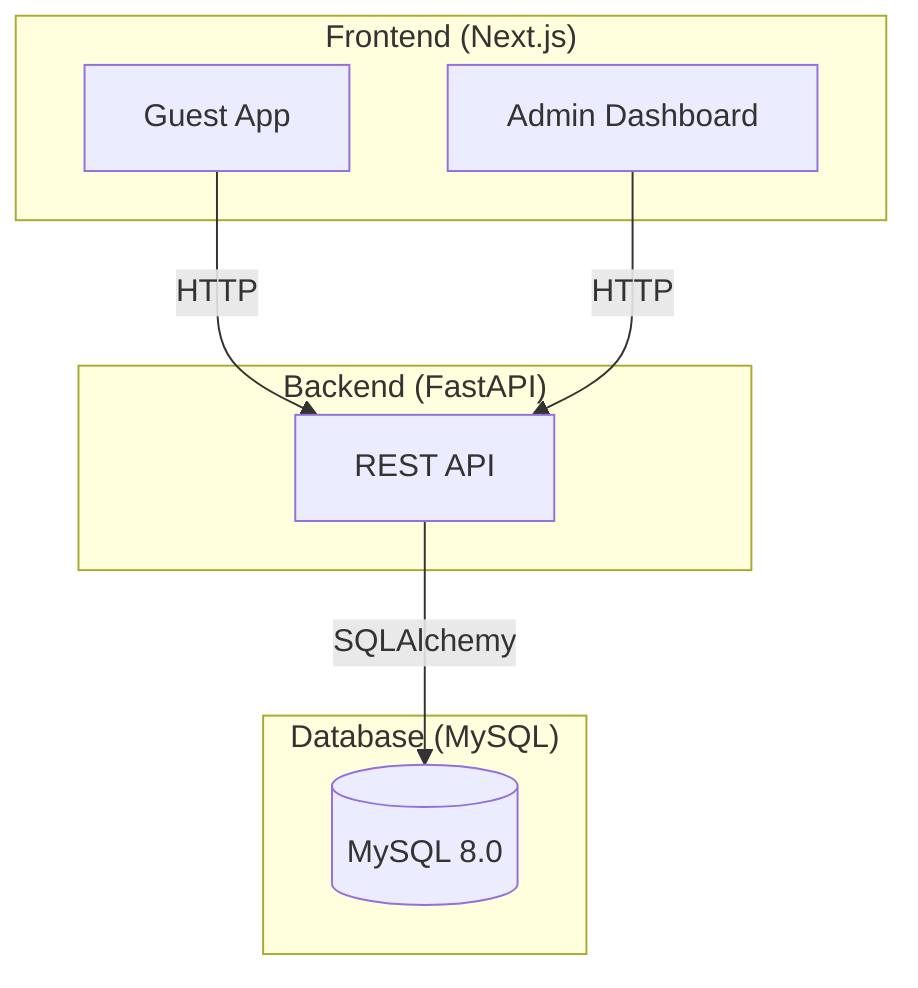
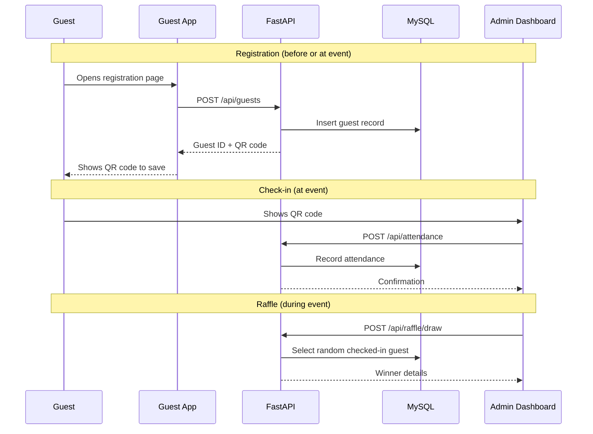
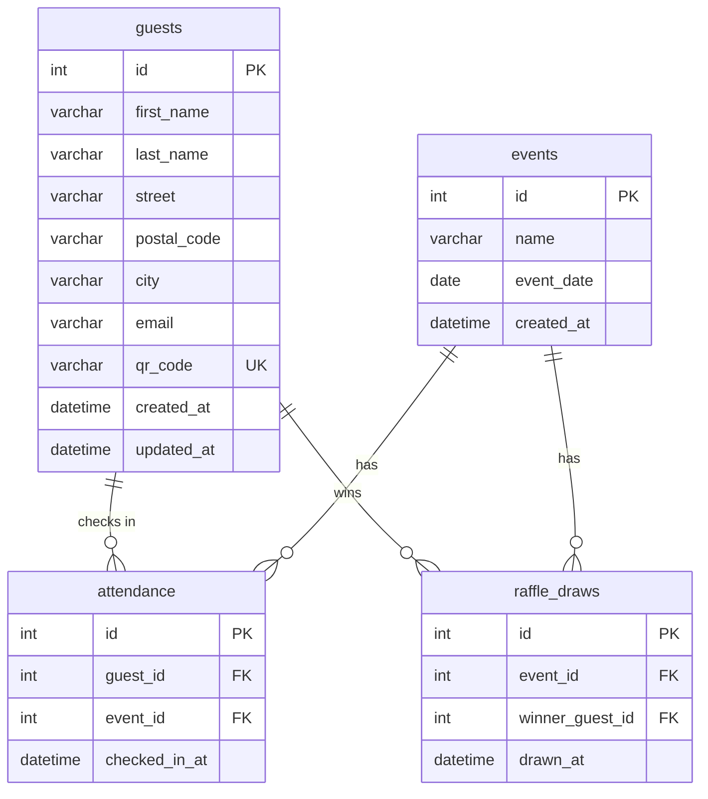

# Project Trace — SuperLottomatch
## System Specification v1.0

**Date:** 2026-03-31
**Status:** Shipping
**Team Size:** 4
**Timeline:** 5 weeks (GIBZ M426)

---

## Table of Contents
1. [Executive Summary](#1-executive-summary)
2. [Problem Statement](#2-problem-statement)
3. [Solution Architecture](#3-solution-architecture)
4. [Guest App Specification](#4-guest-app-specification)
5. [Admin Dashboard Specification](#5-admin-dashboard-specification)
6. [Backend Specification](#6-backend-specification)
7. [Database Schema](#7-database-schema)
8. [AI Pipeline](#8-ai-pipeline)
9. [Data Model](#9-data-model)
10. [API Contracts](#10-api-contracts)
11. [Infrastructure](#11-infrastructure)
12. [Testing Strategy](#12-testing-strategy)
13. [Demo Data](#13-demo-data)

---

## 1. Executive Summary

SuperLottomatch is a web application that digitalizes the annual Lottomatch raffle event organized by STV Ennetbürgen. It replaces the current manual workflow of paper slips and Excel spreadsheets with a mobile-friendly guest registration system, QR-code-based check-in, and an automated raffle draw. The system consists of a Next.js guest-facing app, a Next.js admin dashboard, a Python FastAPI backend, and a MySQL database.

Key facts:
- **80%+ returning guests** year over year
- **Two-day event** with guests potentially attending both days
- **Target demographic:** majority aged 40+
- **Marketing channel:** postal mail (email considered for future)
- **Team:** 4 members working in Scrum over 5 sprints

---

## 2. Problem Statement

### Current State
The STV Ennetbürgen currently manages the Lottomatch raffle through a semi-digital process:
- Guest addresses are stored in an Excel spreadsheet, each with a unique ID
- Returning guests receive pre-printed paper slips with their address and ID via postal mail
- New guests fill out blank paper slips at the event
- During the event, club members manually match collected slips against the Excel spreadsheet
- Guests not seen in 3+ years are removed from the list

### Pain Points
| Problem | Impact |
|---------|--------|
| Manual Excel matching during the event | Slow — 30+ seconds per guest, creates bottlenecks |
| Handwritten slips from new guests | Hard to read, leads to data entry errors |
| No real-time attendance tracking | Club members cannot see who has checked in |
| 3-year cleanup rule is manual | Easy to forget, leads to stale data or accidental deletions |
| Paper slips can be lost | Guests may not be entered into the raffle |

### Opportunity
Digitalize the entire flow from address registration through raffle draw, reducing check-in time from 30+ seconds to under 5 seconds per guest while eliminating manual data entry errors.

---

## 3. Solution Architecture

### High-Level Overview



### User Flow



---

## 4. Guest App Specification

The guest-facing app is a public Next.js application optimized for mobile devices and older users.

### Pages

| Route | Page | Description |
|-------|------|-------------|
| `/` | Landing Page | Event branding, two CTAs: "Ich bin neu" (new guest) and "Ich war schon da" (returning guest) |
| `/register` | Registration | Form: Vorname, Nachname, Strasse, PLZ, Ort. On submit: shows personal QR code |
| `/checkin` | Returning Guest | Enter last name or scan pre-printed QR code from invitation letter. Confirms identity, one-tap check-in |
| `/confirmed` | Confirmation | "Du bist dabei!" message with QR code to save/screenshot |

### Design Constraints

- **Minimum font size:** 18px for body text
- **Touch targets:** minimum 48px height
- **Contrast:** WCAG AA compliant (4.5:1 ratio minimum)
- **Language:** German throughout
- **Max steps:** 2 screens to complete any action
- **No login required** for guests
- **Responsive:** mobile-first, works on laptop at event station

---

## 5. Admin Dashboard Specification

The admin dashboard is a protected Next.js application used by STV club members to manage guests, perform check-ins, and run the raffle.

### Pages

| Route | Page | Description |
|-------|------|-------------|
| `/admin/login` | Login | Single shared password for all club members |
| `/admin/guests` | Guest List | Searchable/filterable table of all guests. Columns: ID, Name, Address, Last Attended, Status. Inline edit. CSV export for postal mail merge |
| `/admin/checkin` | Check-in Station | QR code scanner via device camera. Manual name lookup as fallback. Shows guest info on scan, one-click confirm |
| `/admin/raffle` | Raffle Draw | Select event day (Day 1, Day 2, or both). "Draw Winner" button with animated reveal. Draw history to prevent duplicates. Redraw option |
| `/admin/cleanup` | Address Cleanup | Lists guests not attended in 3+ years. Bulk select and archive/delete. Run before sending next year's invitations |

### Authentication
- Single shared password set via environment variable
- JWT token issued on login, valid for 24 hours (covers one event day)
- No individual user accounts — appropriate for ~10 club members with no IT knowledge

---

## 6. Backend Specification

### Technology
- **Runtime:** Python 3.12+
- **Framework:** FastAPI
- **ORM:** SQLAlchemy 2.0
- **Validation:** Pydantic v2
- **Server:** Uvicorn
- **Auth:** PyJWT

### Project Structure

```
backend/
├── app/
│   ├── main.py              # FastAPI app, CORS, router includes
│   ├── database.py           # Database connection and session management
│   ├── config.py             # Environment variables and settings
│   ├── routers/
│   │   ├── guests.py         # Guest CRUD and search
│   │   ├── attendance.py     # Check-in and attendance
│   │   ├── raffle.py         # Raffle draw logic
│   │   ├── events.py         # Event management
│   │   └── auth.py           # Admin authentication
│   ├── models/
│   │   ├── guest.py          # Guest SQLAlchemy model
│   │   ├── event.py          # Event SQLAlchemy model
│   │   ├── attendance.py     # Attendance SQLAlchemy model
│   │   └── raffle_draw.py    # RaffleDraw SQLAlchemy model
│   └── schemas/
│       ├── guest.py          # Guest Pydantic schemas
│       ├── event.py          # Event Pydantic schemas
│       ├── attendance.py     # Attendance Pydantic schemas
│       └── raffle.py         # Raffle Pydantic schemas
├── tests/
├── requirements.txt
└── Dockerfile
```

---

## 7. Database Schema

### Entity-Relationship Diagram



### Table Definitions

**guests**

| Column | Type | Constraints |
|--------|------|-------------|
| id | INT | PRIMARY KEY, AUTO_INCREMENT |
| first_name | VARCHAR(100) | NOT NULL |
| last_name | VARCHAR(100) | NOT NULL |
| street | VARCHAR(200) | NOT NULL |
| postal_code | VARCHAR(10) | NOT NULL |
| city | VARCHAR(100) | NOT NULL |
| email | VARCHAR(200) | NULLABLE (for future email marketing) |
| qr_code | VARCHAR(36) | UNIQUE, NOT NULL (UUID v4) |
| created_at | DATETIME | DEFAULT CURRENT_TIMESTAMP |
| updated_at | DATETIME | ON UPDATE CURRENT_TIMESTAMP |

**events**

| Column | Type | Constraints |
|--------|------|-------------|
| id | INT | PRIMARY KEY, AUTO_INCREMENT |
| name | VARCHAR(100) | NOT NULL |
| event_date | DATE | NOT NULL |
| created_at | DATETIME | DEFAULT CURRENT_TIMESTAMP |

**attendance**

| Column | Type | Constraints |
|--------|------|-------------|
| id | INT | PRIMARY KEY, AUTO_INCREMENT |
| guest_id | INT | FOREIGN KEY → guests.id, NOT NULL |
| event_id | INT | FOREIGN KEY → events.id, NOT NULL |
| checked_in_at | DATETIME | DEFAULT CURRENT_TIMESTAMP |
| | | UNIQUE(guest_id, event_id) |

**raffle_draws**

| Column | Type | Constraints |
|--------|------|-------------|
| id | INT | PRIMARY KEY, AUTO_INCREMENT |
| event_id | INT | FOREIGN KEY → events.id, NOT NULL |
| winner_guest_id | INT | FOREIGN KEY → guests.id, NOT NULL |
| drawn_at | DATETIME | DEFAULT CURRENT_TIMESTAMP |

---

## 8. AI Pipeline

Not applicable for this project.

---

## 9. Data Model

See [Section 7: Database Schema](#7-database-schema) for the full entity-relationship diagram and table definitions.

### Key Relationships
- A **guest** can attend many **events** (via the attendance join table)
- An **event** spans one day — a two-day Lottomatch is modeled as two separate events
- A **guest** can only check in once per event (UNIQUE constraint on guest_id + event_id)
- A **raffle draw** references both the event and the winning guest
- A guest can win multiple times across different events but not twice in the same event draw session

---

## 10. API Contracts

All endpoints are prefixed with `/api`. Request and response bodies are JSON.

### Guests

| Method | Endpoint | Description | Auth |
|--------|----------|-------------|------|
| POST | `/api/guests` | Register a new guest | No |
| GET | `/api/guests` | List all guests (paginated, searchable) | Yes |
| GET | `/api/guests/{id}` | Get guest by ID | Yes |
| GET | `/api/guests/qr/{qr_code}` | Look up guest by QR code | No |
| PUT | `/api/guests/{id}` | Update guest info | Yes |
| DELETE | `/api/guests/{id}` | Remove guest | Yes |
| GET | `/api/guests/export` | Export guest list as CSV | Yes |

**POST /api/guests** — Request:
```json
{
  "first_name": "Hans",
  "last_name": "Müller",
  "street": "Dorfstrasse 12",
  "postal_code": "6373",
  "city": "Ennetbürgen"
}
```

**POST /api/guests** — Response (201):
```json
{
  "id": 1,
  "first_name": "Hans",
  "last_name": "Müller",
  "street": "Dorfstrasse 12",
  "postal_code": "6373",
  "city": "Ennetbürgen",
  "qr_code": "a1b2c3d4-e5f6-7890-abcd-ef1234567890",
  "created_at": "2026-03-31T10:00:00"
}
```

### Attendance

| Method | Endpoint | Description | Auth |
|--------|----------|-------------|------|
| POST | `/api/attendance` | Check in a guest | Yes |
| GET | `/api/attendance?event_id={id}` | List attendance for an event | Yes |
| GET | `/api/guests/{id}/attendance` | Attendance history for a guest | Yes |

**POST /api/attendance** — Request:
```json
{
  "guest_id": 1,
  "event_id": 1
}
```

### Raffle

| Method | Endpoint | Description | Auth |
|--------|----------|-------------|------|
| POST | `/api/raffle/draw` | Draw a random winner from checked-in guests | Yes |
| GET | `/api/raffle/history?event_id={id}` | List past draws for an event | Yes |

**POST /api/raffle/draw** — Request:
```json
{
  "event_id": 1
}
```

**POST /api/raffle/draw** — Response (200):
```json
{
  "id": 1,
  "event_id": 1,
  "winner": {
    "id": 7,
    "first_name": "Maria",
    "last_name": "Steiner",
    "city": "Stans"
  },
  "drawn_at": "2026-03-31T20:30:00"
}
```

### Events

| Method | Endpoint | Description | Auth |
|--------|----------|-------------|------|
| POST | `/api/events` | Create an event | Yes |
| GET | `/api/events` | List all events | Yes |
| GET | `/api/events/{id}` | Get event details | Yes |

### Auth

| Method | Endpoint | Description | Auth |
|--------|----------|-------------|------|
| POST | `/api/auth/login` | Admin login | No |

**POST /api/auth/login** — Request:
```json
{
  "password": "***"
}
```

**POST /api/auth/login** — Response (200):
```json
{
  "token": "eyJhbGciOiJIUzI1NiIs...",
  "expires_in": 86400
}
```

---

## 11. Infrastructure

### Repository
- **GitHub:** `rabbitglauser/super-lottomatch`
- **Structure:** Monorepo with `/frontend` and `/backend` top-level directories

### CI/CD Pipeline
- **Platform:** GitHub Actions
- **Trigger:** Every push and pull request on all branches
- **Stages:**
  1. Install dependencies (frontend + backend in parallel)
  2. Lint (ESLint for frontend, Ruff for backend)
  3. Run tests (Jest for frontend, pytest for backend)
  4. Check coverage (fail if below 75%)
  5. Build (Next.js build for frontend)
  6. Deploy (on `main` branch only)

### Deployment
| Component | Platform | Notes |
|-----------|----------|-------|
| Frontend | Vercel | Automatic Next.js deployment, free tier |
| Backend | Railway or Render | Python runtime, free tier |
| Database | PlanetScale or Railway | MySQL 8.0, free tier |

### Local Development
- **Docker Compose** for MySQL + backend + frontend
- Hot reload enabled for both frontend and backend

---

## 12. Testing Strategy

### Coverage Target
- **Minimum:** 75% line coverage for both frontend and backend
- **CI enforcement:** Build fails if any test fails or coverage drops below threshold

### Backend Testing (pytest)
| Area | What to test |
|------|-------------|
| Guest CRUD | Create, read, update, delete operations |
| Attendance | Check-in, duplicate prevention (unique constraint), history retrieval |
| Raffle | Random draw from checked-in guests only, exclusion of already-drawn winners |
| Auth | Password validation, JWT token generation and expiry |
| Validation | Pydantic schema validation for all endpoints |
| CSV Export | Correct format and content of guest list export |

**Tools:** pytest, pytest-cov, httpx (for async test client)

### Frontend Testing (Jest + React Testing Library)
| Area | What to test |
|------|-------------|
| Registration form | Field validation, submission, QR code display |
| Check-in flow | QR scan trigger, name lookup, confirmation |
| Admin dashboard | Guest list rendering, search/filter, raffle draw |
| Components | Buttons, inputs, modals render correctly |

**Tools:** Jest, React Testing Library, @testing-library/user-event

### Integration Testing
- FastAPI `TestClient` for end-to-end API tests
- SQLite in-memory database for fast test execution

---

## 13. Demo Data

A seed script (`backend/seed.py`) populates the database with realistic test data:

### Events
| Name | Date |
|------|------|
| Lottomatch 2026 — Tag 1 | 2026-04-05 |
| Lottomatch 2026 — Tag 2 | 2026-04-06 |

### Sample Guests (20)
Swiss-German addresses from the Ennetbürgen region:

| # | Name | Address |
|---|------|---------|
| 1 | Hans Müller | Dorfstrasse 12, 6373 Ennetbürgen |
| 2 | Maria Steiner | Seeweg 4, 6373 Ennetbürgen |
| 3 | Peter Amstad | Buochserstrasse 8, 6373 Ennetbürgen |
| 4 | Anna Barmettler | Stanserstrasse 22, 6373 Ennetbürgen |
| 5 | Josef Niederberger | Hauptstrasse 15, 6374 Buochs |
| 6 | Ruth Christen | Bahnhofstrasse 3, 6374 Buochs |
| 7 | Werner Lussi | Kirchweg 7, 6370 Stans |
| 8 | Elisabeth Odermatt | Schmiedgasse 11, 6370 Stans |
| 9 | Karl Bürgi | Seestrasse 19, 6375 Beckenried |
| 10 | Margrit Wyrsch | Rütenenstrasse 5, 6375 Beckenried |
| 11 | Franz Achermann | Hergiswilstrasse 14, 6052 Hergiswil |
| 12 | Heidi Zimmermann | Kirchplatz 2, 6052 Hergiswil |
| 13 | Bruno Kiser | Pilatusstrasse 33, 6003 Luzern |
| 14 | Silvia Mathis | Weggisgasse 6, 6004 Luzern |
| 15 | Thomas Flühler | Oberdorfstrasse 9, 6373 Ennetbürgen |
| 16 | Verena Käslin | Nidwaldnerstrasse 17, 6370 Stans |
| 17 | Alois Durrer | Rotzlochstrasse 21, 6370 Oberdorf |
| 18 | Monika Bieri | Dallenwilerstrasse 4, 6383 Dallenwil |
| 19 | Stefan Waser | Kernserstrasse 10, 6060 Sarnen |
| 20 | Claudia Murer | Stansstaderstrasse 8, 6362 Stansstad |

### Pre-seeded Attendance
- 15 of 20 guests checked in for Tag 1 (guests 1–15)
- Simulates the 80% returning guest rate

### Pre-seeded Raffle Draws
- 2 draws for Tag 1: Guest #7 (Werner Lussi) and Guest #12 (Heidi Zimmermann)
